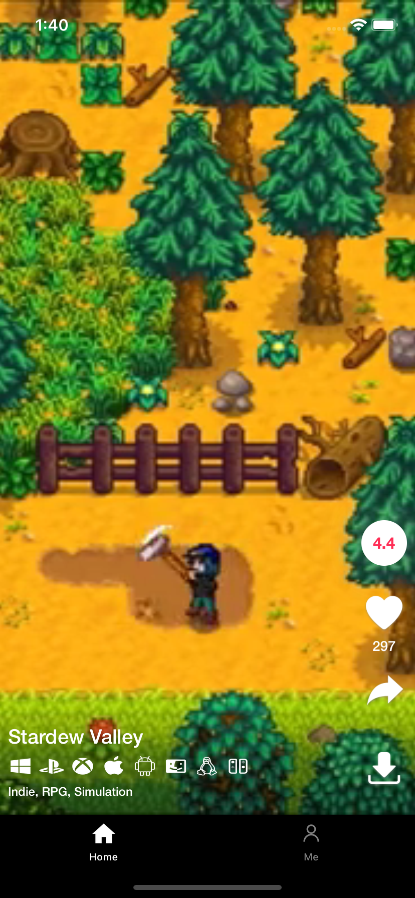

## The application use MVVM

- Testable
- UI-independent (the UI can easily be changed without changing the system)
- Independent of databases, frameworks, external agencies, and libraries

## The software architecture scheme

- The UI can only communicate with the ViewModel
- The ViewModel can only communicate with the Repository
- And the Repository can only communicate with the Datasource, Service

## Screenshots

 

## Used libraries 

- [Rx](https://github.com/ReactiveX/RxSwift)
- [Realm Swift](https://realm.io/docs/swift/latest/)
- [Kingfisher](https://github.com/onevcat/Kingfisher)
